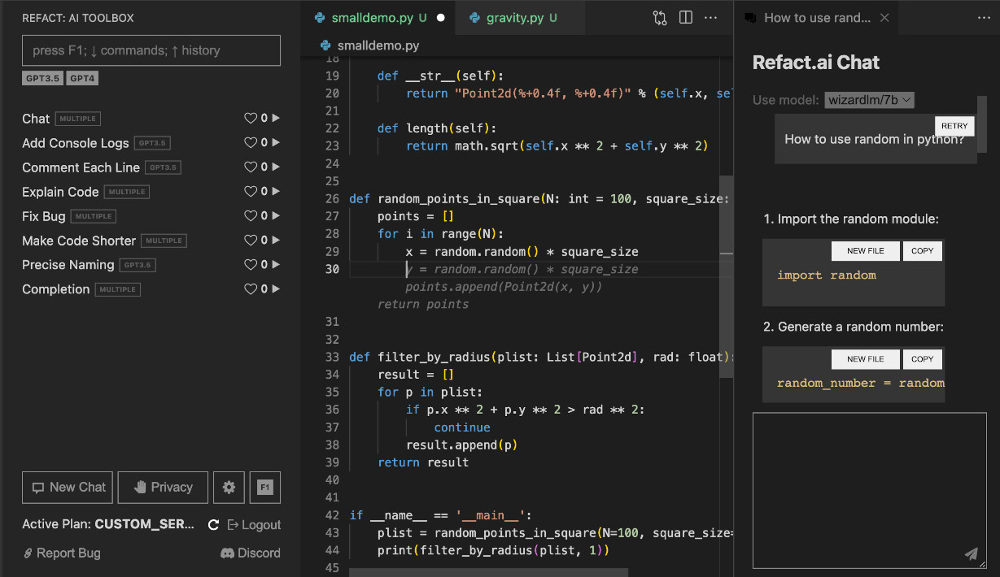

<div align="center">

# <font color="red">[{</font> Refact.ai Inference Server

</div>

This is a self-hosted server for the [refact.ai](https://www.refact.ai) coding assistant. By running
your own server, you can ensure that your code remains under your control. This server supports:

 * Code completion
 * AI Toolbox
 * Chat
 * Fine tuning on your codebase

You can run Refact models, plus WizardCoder, StarChat and other open models. To fine tune on your code,
use CONTRASTcode/3b/multi model that's high quality and fast. You'll need 12Gb of GPU memory to fine tune it.

Refact is currently available as a plugin for [JetBrains](https://plugins.jetbrains.com/plugin/20647-refact-ai)
IDEs and [VS Code](https://marketplace.visualstudio.com/items?itemName=smallcloud.codify).

[Join us on Discord](https://discord.gg/Jpa9DGeCfH) and say hi!




## Running Server in Docker

The easiest way to run this server is a pre-build Docker image.

Install [Docker with NVidia GPU support](https://docs.nvidia.com/datacenter/cloud-native/container-toolkit/install-guide.html#docker).
On Windows you need to install WSL 2 first, [one guide to do this](https://docs.docker.com/desktop/install/windows-install).


Run docker container with following command:
```commandline
docker run -d --rm -p 8008:8008 -v perm-storage:/perm_storage --gpus all smallcloud/refact_self_hosting
```

`perm-storage` is a volume that is mounted inside the container. All the configuration files,
downloaded weights and logs are stored here.

To upgrade the docker, delete it using `docker kill XXX` (the volume `perm-storage` will retain your
data), run `docker pull smallcloud/refact_self_hosting` and run it again.

<details><summary>Docker commands super short refresher</summary>
Add your yourself to docker group to run docker without sudo (works for Linux):

```commandline
sudo usermod -aG docker {your user}
```

List all containers:

```commandline
docker ps -a
```

Start and stop existing containers (stop doesn't remove them):

```commandline
docker start XXX
docker stop XXX
```

Shows messages from a container:
```commandline
docker logs -f XXX
```

Remove a container and all its data (except data inside a volume):
```commandline
docker rm XXX
```

Check out or delete a docker volume:
```commandline
docker volume inspect VVV
docker volume rm VVV
```
</details>


## Setting Up Plugins

Go to plugin settings and set up a custom inference URL `http://127.0.0.1:8008`

<details><summary>JetBrains</summary>
Settings > Tools > Refact.ai > Advanced > Inference URL
</details>
<details><summary>VSCode</summary>
Extensions > Refact.ai Assistant > Settings > Infurl
</details>

Now it should work, just try to write some code! If it doesn't, please report your experience to
[GitHub issues](https://github.com/smallcloudai/refact-self-hosting/issues).


## Contributing

Clone this repo and install it for development:

```commandline
git clone https://github.com/smallcloudai/refact
pip install -e refact/
```

To run the whole server, use:

```commandline
python -m self_hosting_machinery.watchdog.docker_watchdog
```

For debugging, it's better to run HTTP server and inference processes separately, for example in
separate terminals.

```commandline
python -m self_hosting_machinery.webgui.webgui
DEBUG=1 python -m self_hosting_machinery.inference.inference_worker --model wizardlm/7b
DEBUG=1 python -m refact_scratchpads_no_gpu.infserver_no_gpu longthink/stable --openai_key sk-XXXYYY
```


## Adding Toolbox Functions

Are you missing a function in the toolbox? It's easy to implement it yourself!

It's even possible without a GPU, clone this repo and install it like this:

```
SETUP_PACKAGE=refact_scratchpads_no_gpu pip install -e refact/
```

In this folder `refact_scratchpads_no_gpu/gpt_toolbox/toolbox_functions` there are some
functions implemented using OpenAI API. There you can add a new one by analogy, or even
make an existing function better.

To test your function, run `infserver_no_gpu` as in the previous section.


## Fine Tuning

*Why?*  Code models are trained on a vast amount of code from the internet, which may not perfectly
align with your specific codebase, APIs, objects, or coding style.
By fine-tuning the model, you can make it more familiar with your codebase and coding patterns.
This allows the model to better understand your specific needs and provide more relevant and
accurate code suggestions. Fine-tuning essentially helps the model memorize the patterns and
structures commonly found in your code, resulting in improved suggestions tailored to your
coding style and requirements.

*Which Files to Feed?*  It's a good idea to give the model the current code of your projects,
because it's likely any new code in the same project will be similar -- that's what makes
suggestions relevant and useful. However, it's NOT a good idea feed 3rd party libraries that
you use, as the model may learn to generate code similar to the internals of those libraries.

*GUI*  Use `Sources` and `Finetune` tabs in the web UI to upload files (.zip, .gz, .bz2 archive, or
a link to your git repository) and run the fine-tune process. After the fine-tuning process
finishes (which should take several hours), you can dynamically turn it on and off and observe
the difference it makes for code suggestions.

There's a catch: both VS Code and JB plugins cache the responses. To force the model to produce
a new suggestion (rather than immediately responding with a cached one), you can change the text
a few lines above, for example, a comment. Alternatively,
you can use the Manual Suggestion Trigger (a key combination), which always produces a new suggestion.


## FAQ

Q: Can I run a model on CPU?
A: it doesn't run on CPU yet, but it's certainly possible to implement this.
[Join us on Discord](https://discord.gg/Jpa9DGeCfH) to participate.


## Community & Support

Join our
[Discord server](https://www.smallcloud.ai/discord) and follow our
[Twitter](https://twitter.com/refact_ai) to get the latest updates.


## Contributing

We are open for contributions. If you have any ideas and ready to implement this, just:
- make a [fork](https://github.com/smallcloudai/refact-self-hosting/fork)
- make your changes, commit to your fork
- and open a PR
